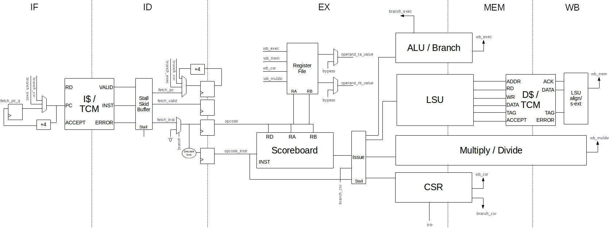
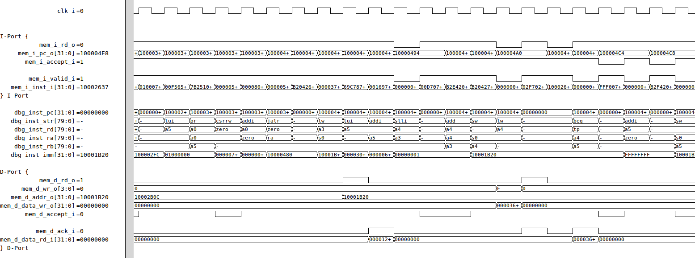

# RISC-V Core

Github: http://github.com/ultraembedded/riscv

A simple RISC-V core written in Verilog and an instruction set simulator supporting RV32IM.
This core has been tested against a co-simulation model, and exercised on FPGA.

## Overview


## Directories

| Name                | Contents                                            |
| ------------------- | --------------------------------------------------- |
| core/rv32i          | RISC-V pipelined RV32I CPU core (Verilog)           |
| core/rv32i_spartan6 | RISC-V pipelined RV32I optimised for small Spartan6 |
| core/rv32im         | RISC-V pipelined RV32IM CPU core (Verilog)          |
| core/rv32imsu       | RISC-V pipelined RV32IM with supervisor and MMU     |
| isa_sim             | Instruction set simulator (C)                       |
| top_tcm_axi/src_v   | Core instance with 64KB DP-RAM & AXI Interfaces     |
| top_tcm_axi/tb      | System-C testbench for the core                     |

## Features

The top (riscv_tcm_top) contains;
* RISC-V core (RV32IM instructions supported).
* 64KB dual ported RAM for (I/D code and data).
* AXI4 slave port for loading the RAM, DMA access, etc (including support for burst access).
* AXI4-Lite master port for CPU access to peripherals.
* Separate reset for CPU core to dual ported RAM / AXI interface (to allow program code to be loaded prior to CPU reset de-assertion).

## Memory Map

| Range                     | Description                                         |
| ------------------------- | --------------------------------------------------- |
| 0x0000_0000 - 0x0000_ffff | 64KB TCM Memory                                     |
| 0x0000_2000               | Boot address (configurable, see RISCV_BOOT_ADDRESS) |
| 0x8000_0000 - 0xffff_ffff | Peripheral address space (from AXI4-L port)         |

## Interfaces

| Name         | Description                                                           |
| ------------ | --------------------------------------------------------------------- |
| clk_i        | Clock input                                                           |
| rst_i        | Async reset, active-high. Reset memory / AXI interface.               |
| rst_cpu_i    | Async reset, active-high. Reset CPU core (excluding AXI / memory).    |
| axi_t_*      | AXI4 slave interface for access to 64KB TCM memory.                   |
| axi_i_*      | AXI4-Lite master interface for CPU access to peripherals.             |
| intr_i       | Active high interrupt input (for connection external int controller). |

## Testbench

A basic System-C / Verilator based testbench for the core is provided.

Dependancies;
* gcc
* make
* libelf
* System-C (specify path using SYSTEMC_HOME)
* Verilator (specify path using VERILATOR_SRC)

To build the testbench;
```
cd top_tcm_axi/tb
make
````

To run the provided test executable;
```
cd top_tcm_axi/tb
make run
````

## Execution Example


